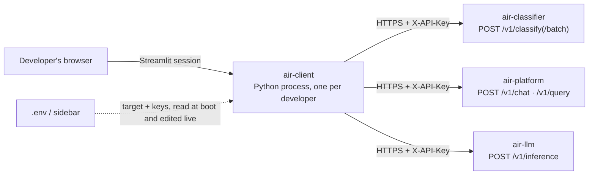

<!--
This file follows a convention meant to be shared across every air-* repo:
frontmatter for machine-readable facts, then the fixed section order below
(Need, Architecture, Design, Implementation, Demo, Gaps, Roadmap). A tool that
walks every air-* repo's docs/overview.md can rely on both the frontmatter
keys and these exact headings being present, in this order, everywhere. If
this becomes the actual convention, keep it byte-for-byte consistent across
repos rather than letting each one drift into its own shape.
-->

# air-client — Overview

## Need

Three (soon more) AIR services — air-classifier, air-platform, air-llm — each
expose an HTTP API that changes shape as they're actively developed. Before
this tool existed, verifying a request against a real deployment meant a
throwaway `curl` command or a scratch script, rebuilt from scratch, by hand,
every time — with no shared record of what was actually sent or received.

air-client exists to answer one question quickly and reliably: **"what does
this service actually do, right now, against this environment, for this
input?"** — for three audiences:

- **Engineers integrating a module against an AIR service**, who need to see
  a real request/response shape before writing code against it.
- **QA verifying a deployment**, who need to reproduce a specific case against
  a specific environment and attach the evidence to a report.
- **Whoever is on call**, who needs to replay a suspect input against staging
  or production-adjacent environments without deploying anything.

What "done" looks like: point the console at any environment (local, QA,
staging), authenticate the same way any real caller would, build a request
through a form that matches the service's actual schema, see the decoded
response *and* the raw JSON, and copy a cURL command that reproduces the
exact call — all without writing or deploying code.

**Explicit non-goals.** This is not a production service, not customer-facing,
carries no uptime expectation, and holds no business logic of its own — it is
a thin, honest window onto services that do. Every design decision below
follows from that.

## Architecture



- **One process per developer, no shared server.** Each engineer clones the
  repo and runs their own Streamlit instance, pointed at whichever deployment
  they're testing — usually a remote one. There is no hosted air-client and
  no shared state between developers' sessions.
- **Outbound-only, over the same authenticated path a real caller uses.**
  air-client calls every service via plain `httpx` requests carrying
  `X-API-Key`, identically to any other consumer. Testing through the console
  exercises the real auth and validation path, not a stub or a mock.
- **No database, no server-side persistence beyond the running process.**
  Session state (the last response per tab, the call log, target selections)
  lives in Streamlit's `st.session_state` and disappears when the process
  stops. Durable configuration — which environments exist, their base URLs
  and keys — lives in `.env`, read once at boot; the sidebar can override it
  for the running session but never writes back to disk.
- **Two run modes, one configuration surface.** Native (`make run`, Python
  3.12) for editing the console itself — auto-reloads on save. Containerised
  (`make up`, Docker) for using it with nothing installed. Both read the same
  `.env` and `.streamlit/config.toml`; the only behavioural difference is that
  the container re-points the `local` target at `host.docker.internal`, since
  `localhost` inside a container means the container itself.
- **Every backend dependency is optional at any given moment.** A service
  being unreachable, unkeyed, or degraded is a rendered state (a red chip, an
  error message, a `degraded: true` badge), never a crash — because the whole
  point of the tool is to be usable *while* the thing it's pointed at is
  half-broken.
- **One `Connection` per service pairing, four today:** classifier,
  platform-customer, platform-business (air-platform's two channels come from
  two distinct API keys, never a header — the console holds both), and llm.
  Adding a fifth service means adding a fifth `Connection` through the same
  seam — see Roadmap.

## Design

The principles that shaped *how* the architecture above was built, not just
what it consists of:

- **State the destination everywhere, unprompted.** The single most expensive
  mistake this tool can permit is sending a request to the wrong environment
  — a QA fixture posted at staging, a local pass mistaken for a QA one. So the
  target bar, every tab's caption, and every Send button's label state the
  destination before you click anything, and colour anything that isn't
  `localhost` amber.
- **Never let the console lie about what it sent.** Every request model these
  services expose sets `additionalProperties: false` and treats "field
  absent" and "field explicitly set to its default" as different requests
  (`Options.model_fields_set` is load-bearing server-side on air-classifier —
  a key carrying `force_pii_redaction` rejects an *explicit* `redact_pii: false` but accepts the same value arriving unspoken). So every optional
  field gets an enable checkbox, and an unticked one is omitted from the
  payload entirely rather than sent at its default — what you build in the
  form is exactly what the "Request body preview" and the cURL export show,
  with nothing invented on the way.
- **Dense, professional, state-driven — not decorative.** Response summaries
  render through one shared component (`dashboard.py`): a bordered grid of
  monospace `key value` rows, colour reserved for something actually worth a
  second look (a failure, a ceiling reached, a flag raised) rather than
  colouring every field regardless of whether it means anything.
- **Degrade visibly, never silently.** A network failure is a rendered
  `Exchange` with an error message, not a raised exception — a refused
  connection is an ordinary, expected result when the thing under test is
  also mid-development. Nothing about a bad response ever produces a Python
  traceback in the UI.
- **Light and dark are both first-class**, because these screens get stared
  at for hours during a debugging session, not glanced at once. Every colour
  in the console is a CSS custom property declared once in two palettes
  (`theme.py`); nothing is hardcoded outside them.
- **Reuse one abstraction per axis of variation**, not one per tab. One
  `Connection` shape serves every service regardless of auth model. One
  `dashboard.grid()` renders every response summary. One `http.send()` /
  `Exchange` pair drives every call and every cURL reproduction. A new tab is
  new domain-specific form logic wired onto machinery that already exists,
  not new plumbing.

## Implementation

**Stack:** Python ≥3.12, `streamlit>=1.40`, `httpx>=0.27`. No database, no
task queue, no build step. Dev tooling: `ruff>=0.8`, `mypy>=1.13` (strict).

```text
src/air_client/
  app.py                  entry point — resolves connections, draws the 4 tabs
  config.py               named targets (base URLs + keys) read from .env
  connection.py           the resolved destination, handed to every tab
  currency.py             USD -> INR display for cost figures, not a live rate
  dashboard.py            the dense data-grid every response summary is built from
  http.py                 one request in, one Exchange out; cURL rendering
  state.py                session-scoped storage, so responses survive reruns
  theme.py                the CSS — fonts, palettes, density, dashboard.py's grid styling
  components/
    sidebar.py            target switcher and connection settings
    target_bar.py         the "where is this going" strip and health probe
    response_view.py      the shared response pane (Summary / Response / Headers / Request)
    summary.py            decoding a /v1/classify response into the dashboard grid
  tables.py               columns Arrow can type; mixed-type ones render as text
  tabs/
    classifier.py       /v1/classify, single + batch, tier probes
    platform.py         /v1/chat, /v1/query, proposal confirm/decline
    llm.py               /v1/inference — chat + embeddings, one endpoint
    system.py            health / ready / capabilities across all three services
```

**Verification today:** `make check` runs `ruff check` and `mypy --strict`
over `src/`. There is no automated test suite (see Gaps) — functional
verification is a headless `streamlit run` boot check (confirms every tab's
render path executes without raising) plus manual click-through.

**Notable implementation choices worth knowing before touching the code:**

- `dashboard.py`'s `grid()`/`table_title()` are the only two primitives every
  response summary is built from — extend a summary by adding rows to a
  `grid()` call, not by inventing new widget layouts.
- Every tab's request builder follows the same shape: an "always visible"
  required-field section, an optional-fields expander for fields the service
  accepts but doesn't require, and a tick-to-send **Options** expander for
  anything with server-side default-vs-explicit semantics.
- `currency.py`'s `format_cost()` is the one place USD figures get an
  approximate ₹ figure appended — call it, don't reimplement the conversion
  inline.
- Adding a new backend service means touching five places, in this order:
  `config.py` (`Target` fields and a local default), `sidebar.py` (a new
  section and the `render()` return tuple), `app.py` (a new tab), `system.py`
  (a new probe panel), and a new `tabs/<service>.py`. air-llm's addition is
  the reference example for this pattern.

## Demo

A live walkthrough lands better than a slide deck for this tool — it *is* the
demo. Point it at a real remote QA/staging target beforehand, not just
`local`, since "point this at any environment and never guess where a
request goes" is the whole pitch and is invisible against `local` alone.
Budget **10–15 minutes**.

1. **Sidebar + target bar (1 min).** Show switching targets, the LOCAL/REMOTE
   colouring, and "Check all" probing every service's `/v1/health` at once.
   This is the "you will never accidentally hit the wrong environment" pitch.
2. **Classifier tab — tier probes (3 min).** Open the "Tier probes" expander,
   fire one button per tier (`t0_rules` → `t3_cloud_llm`), and read the
   resulting dashboard grid live: the verdict, the escalation trace with
   which model answered each rung, safety, and cost with its ₹ figure. This
   single sequence demonstrates the escalation ladder, the response schema,
   and the UI's density in one motion.
3. **Request body preview → cURL (1 min).** Show that the exact payload built
   in the form is what gets sent, and that the Request tab's cURL is
   copy-pasteable and reproduces it outside the tool. This is the "you can
   trust what this shows you" pitch.
4. **Platform tab (3 min).** Send a chat turn, show `session_id` carrying
   forward into a second turn, and — if a proposal-capable key is available —
   trigger a proposal and show the Confirm/Decline buttons. With only the
   development keys, name that both will 403 and explain why that's correct.
5. **LLM tab (2 min).** One chat call, one embeddings call, then "Check my
   policy" to show what a key is actually scoped to.
6. **System tab + call log (2 min).** `/v1/capabilities` across all three
   services, then the session's call log — "attach this JSON download to a
   bug report and the exact request is right there."
7. **Theme toggle (30 sec).** Flip light/dark to close — a one-line signal
   that this was built with real design attention, not defaults.

Afterwards, point people at `README.md` for exact run commands and at this
file for the why.

## Gaps

Honest, current limitations — not defects, but things a new owner should
know about before assuming they're covered:

- **No automated test suite.** Verification is `make check` (lint + strict
  types) plus manual boot-testing and click-through. Streamlit's own
  `AppTest` framework could cover widget logic headlessly without a browser;
  nothing has been built against it yet.
- **No CI.** There is no `.github/workflows` — `make check` is not enforced
  anywhere automatically today; it only runs when someone remembers to.
- **No streaming.** air-platform exposes an SSE streaming variant of its
  turn API (`EventType`, per its own `docs/02-lld.md` §4); air-client only
  ever calls the synchronous, non-streaming shape. A turn that would stream
  in a real client is shown only as its final, buffered result here.
- **LLM chat has no real multi-turn UI.** air-llm is stateless per call by
  design (no `session_id`), so a genuine multi-turn exchange means hand-
  pasting a JSON `messages` array into the "Advanced" box — functional, not
  friendly.
- **The USD→INR conversion is a static, manually-set rate**, not a live FX
  feed — labelled as approximate everywhere it appears, but worth knowing
  before anyone reads it as authoritative.
- **The proposal Confirm/Decline flow (Platform tab) is implemented and
  verified structurally (lint, types, a clean boot), but not yet exercised
  end-to-end against a real `allow_actions`-scoped key** — neither
  development key carries that scope, so this path has never actually seen a
  204 back from a real environment.
- **No saved/reusable custom request presets.** Beyond the built-in scenario
  buttons and tier probes, anything a tester types is gone once the session
  ends.
- **Adding a new service tab is manual, not generated** — mechanical (five
  touch points, see Implementation) but by-hand every time.
- **No in-app onboarding.** A new user's path in is this file and the
  README; there's no first-run tour inside the console itself.
- **The Docker path (`make up`) was reviewed and one real gap was fixed
  (the LLM target had no `host.docker.internal` override), but the image has
  not been built and run end-to-end since** — worth a real smoke test before
  relying on it for a demo.
- **Security posture is "local developer tool," deliberately not more.** Keys
  live in `.env` and the sidebar in plaintext; "reveal API key" is the only
  masking. Correct for the stated purpose; not something to extend without
  first reconsidering what this tool is for.
- **`docs/air-platform-demo-outline.md` in this same repo is stale** — an
  early planning-stage deck describing a different air-client (a
  customer-facing chat widget) and speculative architecture for the other
  services that has since been superseded by what was actually built. Worth
  archiving or rewriting before anyone presents from it.

## Roadmap

Extensions identified but not started, roughly in the order they'd pay off:

1. **This document's own premise.** A standardized `docs/overview.md` in
   every air-* repo, aggregated centrally — this file's frontmatter schema
   (`project`, `tagline`, `kind`, `status`, `stack`, `depends_on`, `owner`,
   `last_updated`) and fixed section order are offered as that convention.
   Keeping every repo's file byte-consistent in structure is what makes an
   automated aggregator feasible rather than another one-off parser per repo.
2. **Schema-drift detection.** Cross-check each tab's option editor against
   its service's live OpenAPI/`/v1/capabilities` response, so an API change
   like this session's `/v1/classify` consolidation surfaces as a console
   warning instead of requiring a manual audit to catch.
3. **A real test suite** via Streamlit's `AppTest`, plus a CI workflow
   running `make check` and those tests on every PR.
4. **Streaming support** for air-platform's SSE turns.
5. **Saved, named request presets** a developer can create and keep across
   sessions — the natural next step past the built-in scenario buttons.
6. **A scaffolding generator for new service tabs**, given how mechanical
   (if manual) the five-touch-point pattern already is.
7. **An in-app first-run tour** or inline contextual help.
8. **Considered and explicitly deferred: a full Node.js/React rewrite.**
   Evaluated on cost, effort and feasibility; not pursued. Reasoning for
   whoever picks this up next: the tool's core value is tracking fast-moving
   Python backend APIs quickly, in the same language family; none of the
   three backend services have CORS configured, so a browser-based rewrite
   would require standing up a new Node BFF/proxy (or getting CORS added to
   three services this project doesn't own) before a single request could be
   sent; and reaching feature parity alone was estimated at 3–6 engineer-weeks,
   with a genuinely elevated UI/UX on top realistically pushing past
   6–10 weeks across more than one person. Revisit only if AIR-wide tooling
   standardizes on Node/React for reasons bigger than this one project —
   not as a standalone air-client decision.
